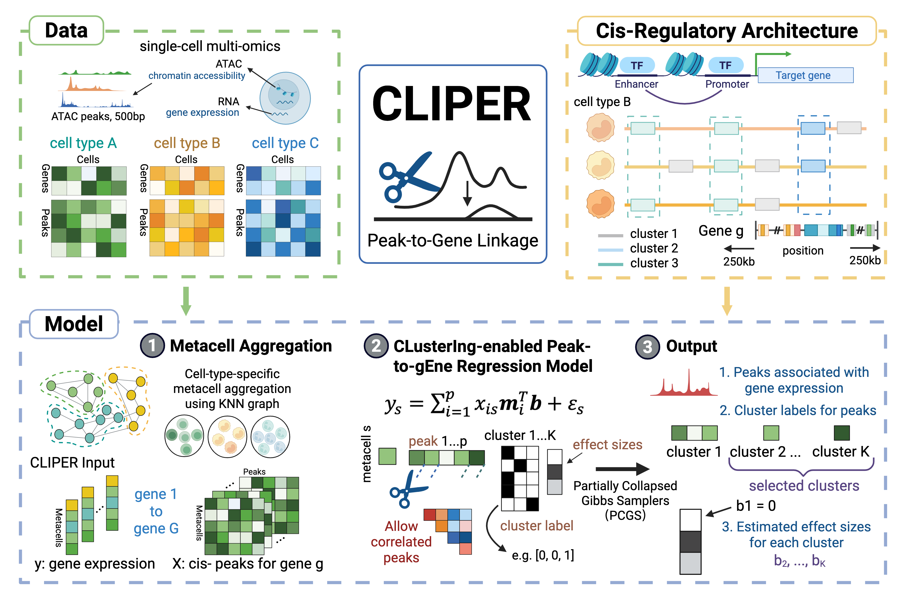

# CLIPER: CLusterIng-enabled Peak-to-gEne Regression

CLIPER is a Bayesian framework for **peak-to-gene association** in single-cell multi-omic data.  
It enables clustering of correlated peaks, reduces dimensionality, and provides interpretable **cis-regulatory modules** with effect size estimates.

---

## Workflow

<p align="center">
  
</p>

---

## Key Features
- **Metacell aggregation**: Stabilizes inference in sparse single-cell data  
- **Clustering-enabled regression**: Groups correlated cis-peaks and assigns shared effect sizes  
- **Bayesian inference**: Robust in small-sample settings with biologically meaningful priors  
- **Biological interpretability**: Identifies peak clusters linked to cytokine-responsive genes and immune pathways  
- **Benchmarking**: Outperforms ArchR, Signac, and SCARlink in fine-mapped eQTL enrichment (GTEx v8)  

---

## Install required R packages:
```{r}
install.packages(c("data.table", "dplyr", "ggplot2", "GenomicRanges", "glmnet"))
```

## Prepare input data
- Peaks: Accessible regions in chr:start-end format
- Gene expression: Normalized counts (per metacell or cell)
- Gene annotation: Chromosome + TSS coordinates
- Reference SNPs (optional): for enrichment analysis

## Output
- Peak–gene associations
- Cluster labels for peaks
- Estimated effect sizes
