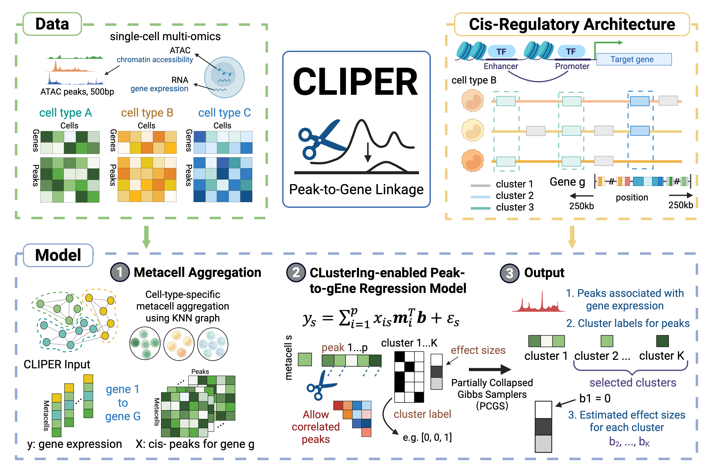

# CLIPER: CLusterIng-enabled Peak-to-gEne Regression

CLIPER is a Bayesian framework for **peak-to-gene association** in single-cell multi-omic data.  
It enables clustering of correlated peaks, reduces dimensionality, and provides interpretable **cis-regulatory modules** with effect size estimates.

---

## Workflow

<p align="center">
  
</p>

---

## Install required R packages:

If dependencies are missing, install common CLIPER dependencies first. This helper is intentionally not exported by the installed package; it is only for setting up the local environment before installation.

```R
source("https://github.com/CHPGenetics/CLIPER/blob/main/R/cliper-loader.R")
cliper_install_deps()
```

Install CLIPER package:

```{r}
if (!requireNamespace("remotes", quietly = TRUE)) {
  install.packages("remotes")
}
remotes::install_github("CHPGenetics/CLIPER")
```

## Usage Example
```R
library(CLIPER)

cliper_obj <- Create_Signac_CLIPER_obj(signac_obj = obj)

out <- Run_CLIPER(
  cliper_obj = cliper_obj,
  gene_list = c("CREM", "PTGER4"),
  gr_anno = Signac::Annotation(obj)
)
```

- Peaks (X): Accessible regions in chr:start-end format
- Gene expression (y): Normalized counts (per metacell or cell)

## Output
- **Peak Posterior inclusion probability (PPIP)** for each peak
- Estimated effect sizes for each peak
