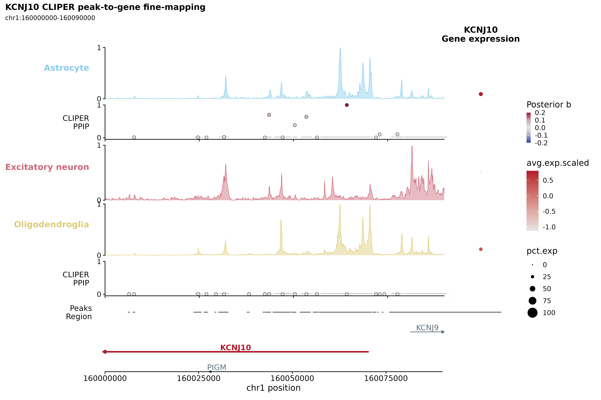

# CLIPER: CLusterIng-enabled Peak-to-gEne Regression

CLIPER is a Bayesian framework for **peak-to-gene fine-mapping** in single-cell multi-omic data. It jointly models candidate cis-regulatory peaks, groups peaks into latent modules with shared effects, and reports **peak-level posterior inclusion probabilities (PPIPs)** and signed effect estimates in each cell type.

## Workflow

<p align="center">
  
</p>
## How CLIPER works

For each target gene and cell type, CLIPER jointly models normalized gene expression and the accessibility of candidate cis-regulatory peaks across metacells. Let $\mathbf{y}\in\mathbb{R}^{n}$ denote the centered expression vector across $n$ metacells, and let $\mathbf{X}=(\mathbf{x}_1,\ldots,\mathbf{x}_p)\in\mathbb{R}^{n\times p}$ denote the accessibility matrix for $p$ retained candidate peaks. Accessibility columns are centered and, by default, standardized to unit standard deviation.

Each peak $i$ is assigned to one of $K$ latent regulatory modules through a one-hot indicator vector $\mathbf{m}_i=(m_{i1},\ldots,m_{iK})^{\mathsf T}$, where $m_{ik}\in\{0,1\}$ and $\sum_{k=1}^{K}m_{ik}=1$. Let $\mathbf{b}=(b_1,\ldots,b_K)^{\mathsf T}$ be the vector of module-level effects. The first module is the **non-effect module**, with $b_1=0$; modules $2,\ldots,K$ have effects that can be positive or negative. The regression model is

$$
y_j=\sum_{i=1}^{p}x_{ji}\mathbf{m}_i^{\mathsf T}\mathbf{b}+\varepsilon_j,
\qquad \varepsilon_j\overset{\mathrm{i.i.d.}}{\sim}N(0,\sigma^2),
\qquad j=1,\ldots,n,
$$

where $x_{ji}$ is the accessibility of peak $i$ in metacell $j$, and $\sigma^2$ is the residual variance. Peaks assigned to the same module share a common effect, reducing the number of distinct effect parameters while jointly accounting for other candidate peaks. $K$ is an upper bound on the number of occupied modules; the default $K=5$ allows one non-effect module and at most four non-null modules.

A Dirichlet prior on module-assignment probabilities encourages sparsity, with `p1` specifying the prior mean probability of assignment to the non-effect module. Non-null module effects have Gaussian priors, and the residual variance has an inverse-gamma prior. Posterior inference uses a **partially collapsed Gibbs sampler**, which integrates out non-null module effects when updating peak assignments.

For peak $i$, the peak-level effect and posterior inclusion probability are

$$
\beta_i=\mathbf{m}_i^{\mathsf T}\mathbf{b},
\qquad
\mathrm{PPIP}_i=1-P(m_{i1}=1\mid\mathbf{X},\mathbf{y}).
$$

CLIPER summarizes post-burn-in draws to report PPIP and the posterior mean and standard deviation of $\beta_i$. Higher PPIP indicates stronger posterior support for a non-null assignment under the model, while the posterior mean effect describes the direction and magnitude of the association, averaging over uncertainty in peak assignments and module effects.

## Installation

If dependencies are missing, install common CLIPER dependencies first. This helper is intentionally not exported by the installed package; it is only for setting up the local environment before installation.

```r
source("https://raw.githubusercontent.com/CHPGenetics/CLIPER/main/R/install-helpers.R")
cliper_install_deps()
```

Install the CLIPER package:

```r
if (!requireNamespace("remotes", quietly = TRUE)) {
  install.packages("remotes")
}
remotes::install_github("CHPGenetics/CLIPER")
```

## Usage example

Starting from a Signac object with paired RNA and ATAC data and gene annotations:

```r
library(CLIPER)

# Adjust assay names and the cell-type metadata column to match your object.
cliper_obj <- Create_Signac_CLIPER_obj(
  signac_obj = obj,
  RNA = "RNA",
  ATAC = "peaks",
  celltype = "broad_celltype"
)

out <- Run_CLIPER(
  cliper_obj = cliper_obj,
  gene_list = c("CREM", "PTGER4"),
  gr_anno = Signac::Annotation(obj)
)
```

The input contains normalized metacell-level ATAC and RNA matrices for each cell type. Peak coordinates and gene annotations must use the same genome assembly and chromosome naming convention.

## Parallel execution

CLIPER combines an **Rcpp implementation** of the Gibbs sampler with scripts for **parallel processing across gene chunks**. The Bash wrapper divides the gene list into chunks, launches independent R processes, and merges their results after completion. Each process analyzes its assigned genes across the cell types in `cliper_obj`.

Save the inputs before launching the parallel run:

```r
saveRDS(cliper_obj, "CLIPER_obj.rds")
writeLines(gene_list, "gene_list.txt")  # One gene symbol per line
saveRDS(Signac::Annotation(obj), "gr_anno_hg38.rds")
```

Run the following from a local checkout of the CLIPER repository, with `scripts/run_cliper_chunks.sh` and `scripts/run_cliper_chunk.R` in the same directory. Replace the example input paths with your own:

```bash
bash scripts/run_cliper_chunks.sh \
  --cliper_obj "CLIPER_obj.rds" \
  --genes "gene_list.txt" \
  --p1 0.7 \
  --gr_anno "gr_anno_hg38.rds" \
  --flank 500000 \
  --outdir "cliper_chunks" \
  --n_chunks 128 \
  --max_jobs 64
```

| Argument | Description |
| --- | --- |
| `--cliper_obj` | RDS file containing the prepared CLIPER input object. |
| `--genes` | Text file containing one gene symbol per line. |
| `--gr_anno` | RDS file containing a gene annotation `GRanges` with a `gene_name` column. |
| `--p1` | Prior mean probability of assignment to the non-effect module; here, 0.7. |
| `--flank` | Extension in base pairs on each side of the annotated gene span; here, 500,000 bp. |
| `--outdir` | Directory for chunk outputs, logs, and merged results. Use a fresh directory for each run. |
| `--n_chunks` | Number of gene subsets; here, 128. |
| `--max_jobs` | Maximum number of concurrent R processes; here, 64. Set this according to allocated CPUs and available memory. |

The runner defaults to `K = 5`, `n_iter = 10000`, and `burn_in = 5000`. These can be changed with `--K`, `--n_iter`, and `--burn_in`. The wrapper launches local processes within the available compute allocation; it does not request CPUs from a cluster scheduler. To use one computational thread per process, set `OMP_NUM_THREADS=1`, `OPENBLAS_NUM_THREADS=1`, and `MKL_NUM_THREADS=1` before launching if applicable to your R installation.

### Example runtime

On a brain Multiome dataset containing **three cell types** (Astrocyte, Excitatory neuron, and Oligodendroglia), **CLIPER was run on 7,214 genes**. The parallel workflow completed in **approximately two hours** with **64 allocated CPUs**, 128 gene chunks, and at most 64 concurrent processes. GNU `time` recorded **2 h 2 min 49 s** of elapsed time for the command above, including chunk execution and merging, using precomputed CLIPER inputs. Runtime depends on the number of genes, candidate peaks and metacells, MCMC settings, and hardware.

### Output files

| File | Contents |
| --- | --- |
| `cliper_merged.rds` | Merged results organized by cell type. |
| `summary_all.csv` | All modeled peak–gene pairs across cell types. |
| `cliper_summary.csv` | Pairs whose most probable module is not the non-effect module. |
| `summary_info.csv` | Gene- and cell-type-level summaries of modal module assignments. |
| `cliper_chunk_XXX_of_YYY.rds` | Results from each gene chunk. |
| `genes_chunk_XXX_of_YYY.txt` | Gene list assigned to each chunk. |
| `logs/` | Per-chunk progress logs. |

## Inspecting the output

```r
cliper_out <- readRDS("cliper_chunks/cliper_merged.rds")
head(cliper_out$`Excitatory neuron`$cliper_summary)
```

Example output from the brain Multiome dataset:

```text
                     Peak  Gene         Cell_Type Cluster Posterior_b Posterior_b_sd     Beta_q025  Beta_q975   PPIP
1 chr15-80002876-80004068 ARNT2 Excitatory neuron       4  0.04014158     0.02873942 -0.0161876803 0.09647083 0.7092
2 chr15-81049311-81051030 ARNT2 Excitatory neuron       4  0.04858696     0.02511323 -0.0006349615 0.09780889 0.8420
3 chr15-80785405-80785741 ARNT2 Excitatory neuron       4  0.04169633     0.02767286 -0.0125424785 0.09593514 0.7450
4 chr15-80798993-80799353 ARNT2 Excitatory neuron       4  0.04803321     0.02470863 -0.0003957077 0.09646212 0.8438
5 chr15-80031909-80033855 ARNT2 Excitatory neuron       4  0.05317782     0.02049578  0.0130060809 0.09334955 0.9290
6  chr4-78551451-78552240 BMP2K Excitatory neuron       5  0.15225516     0.04181863  0.0702906494 0.23421967 0.9990
```

| Column | Meaning |
| --- | --- |
| `Peak` | Candidate peak coordinates, shown here as `chr-start-end`. |
| `Gene` | Target gene symbol. |
| `Cell_Type` | Cell type in which the model was fitted. |
| `Cluster` | Module with the highest posterior assignment probability. Module 1 is the non-effect module; other labels are local to each fitted model and are not comparable across genes or cell types. |
| `Posterior_b` | Posterior mean peak-level effect, averaging over module assignments, including zero-effect draws. Positive and negative values indicate positive and negative conditional associations, respectively. |
| `Posterior_b_sd` | Posterior standard deviation of the peak-level effect; this is not the Monte Carlo standard error of its estimated mean. |
| `Beta_q025` | Lower normal-approximation bound: `Posterior_b - 1.96 * Posterior_b_sd`. |
| `Beta_q975` | Upper normal-approximation bound: `Posterior_b + 1.96 * Posterior_b_sd`. |
| `PPIP` | Posterior probability of assignment to any non-null module: `1 - P(Cluster = 1 | data)`, ranging from 0 to 1. |

Despite their names, `Beta_q025` and `Beta_q975` are **normal-approximation interval bounds**, not empirical posterior quantiles in the current implementation. The peak-effect posterior can include a point mass at zero, so these bounds should be interpreted as approximate uncertainty summaries. Effect sizes are on the scale of the modeled data.

For each cell type, `summary_all` includes all modeled pairs, whereas `cliper_summary` retains pairs with `Cluster != 1`. This is not an automatic high-confidence filter. To apply the manuscript's criteria, use:

```r
high_confidence <- subset(
  cliper_out$`Excitatory neuron`$summary_all,
  PPIP >= 0.8 & abs(Posterior_b) >= 0.01
)
```

## Visualizing peak-to-gene results

`plot_cliper_p2g()` combines cell-type-specific ATAC coverage, peak-level PPIP and effect estimates, genomic annotations, and target-gene expression in a single locus view.

```r
library(CLIPER)
library(Signac)

brain_signac <- readRDS("path/to/cliper_merged.rds")
anno_obj <- Annotation(brain_signac)

plot_cliper_p2g(
  object = brain_signac,
  cliper_output = cliper_out,
  gene = "KCNJ10",
  region = "chr1:160000000-160090000",
  gr_anno = anno_obj,
  celltype_col = "broad_celltype",
  assay_atac = "peaks",
  assay_rna = "RNA"
)
```

The Signac object should contain the ATAC fragment information needed for coverage, RNA expression, and the specified cell-type metadata. The plot uses `summary_all` by default, so low-PPIP peaks can also be displayed.

<p align="center">
  
</p>


At the **KCNJ10** locus, the example highlights a high-PPIP positive peak–gene association in astrocytes, alongside accessibility tracks and gene annotations. PPIP point height represents posterior inclusion probability and point color represents the posterior mean effect; the expression dots show scaled average expression by color and the percentage of expressing cells by size.
